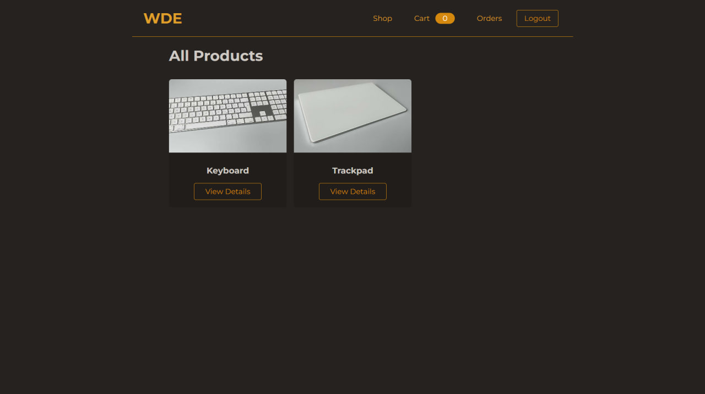
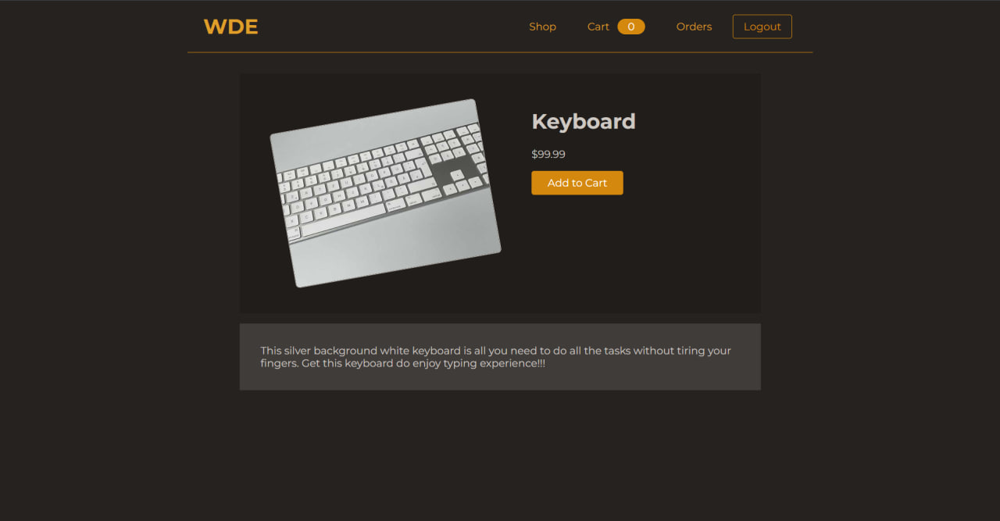
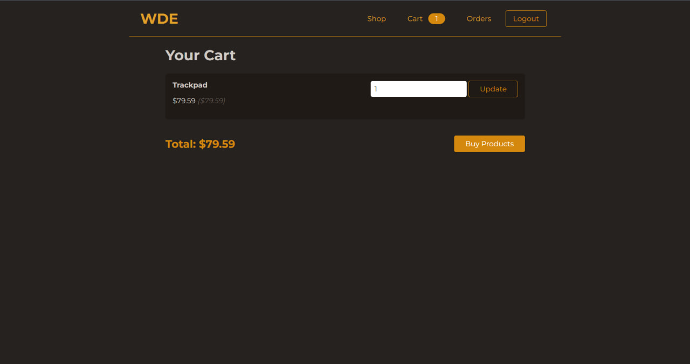
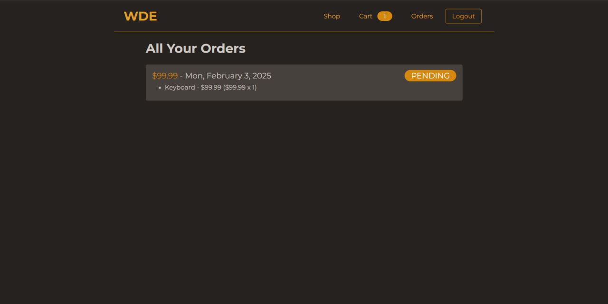

# Online Shop (Full-Stack E-commerce App)

A fully functional e-commerce website built using the MVC architecture. Users can browse products, add items to their cart, and place orders. 
It includes user authentication, product management, and a shopping cart system. This project also features a simple checkout system (with dummy payment) for practice.

## Tech Stack

- **Front-End**: EJS, CSS, 
- **Back-End**: Express.js, Node.js
- **Database**: MongoDB
- **Security**: CSRF protection
- **Tools**: Git, GitHub, npm

## Features

- User authentication (sign-up/login)
- Add-to-cart functionality
- Product browsing and management
- Orders and checkout (dummy payment via Stripe)
- CSRF protection
- Responsive design

## Installation

To run the project locally, follow the steps below:

1. Clone the repository:
   ```bash
   git clone https://github.com/farruxTemurov/fs-online-shop.git

   cd fs-online-shop
   npm install
   npm start

The app should now be running on http://localhost:3000/.

## Screenshots
**Here are some screenshots of the application:**

  
*Caption: The homepage of the application showcasing the product catalog.*

---

  
*Caption: The product details page where users can see more information about a product.*

---

  
*Caption: The shopping cart page where users can review their selected items.*

---

  
*Caption: The orders page where users can view their order history.*


## Contributing
Contributions are welcome! To contribute:

1. Fork this repository
2. Create a new branch (`git checkout -b feature-name`)
3. Commit your changes (`git commit -am 'Add feature'`)
4. Push to the branch (`git push origin feature-name`)
5. Open a Pull Request

